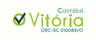

<h1 align="center">
  >
</h1>

  <a href="#-technologies">Technologies</a>&nbsp;&nbsp;&nbsp;|&nbsp;&nbsp;&nbsp;
  <a href="#-project">Project</a>&nbsp;&nbsp;&nbsp;|&nbsp;&nbsp;&nbsp;
  <a href="#memo-license">License</a>

 
  

 

  

## 🚀 Technologies

This project was developed with the following technologies:

- Next.js
- Prismic.io
- EJS

## 💻 Project

Contábil Vitória is an application to get to know the company, get in touch, and it also has a news blog to learn about accounting.

## How to use?

Download this repository and with your terminal, enter in the directory

1. Run the command `yarn` to install the dependencies
2. After, declare the environment variables (PRISMIC_ENDPOINT, PRISMIC_ACCESS_TOKEN, MAIL_ADDRESS and SENDGRID_API_KEY)
3. And to start the application, run the command `yarn dev`

## :memo: License

This project is under MIT license. See the file [LICENSE](.github/LICENSE.md) for more details.

---

Made with ♥ by Pollar code
